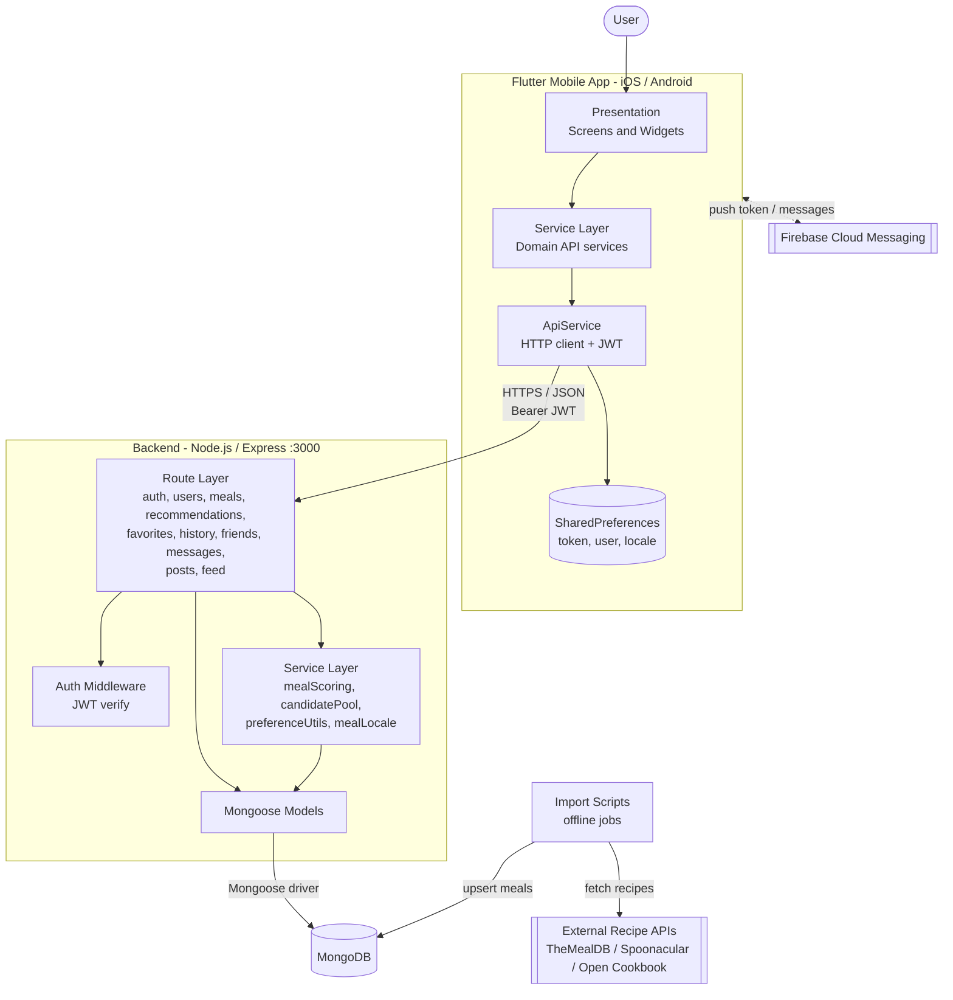
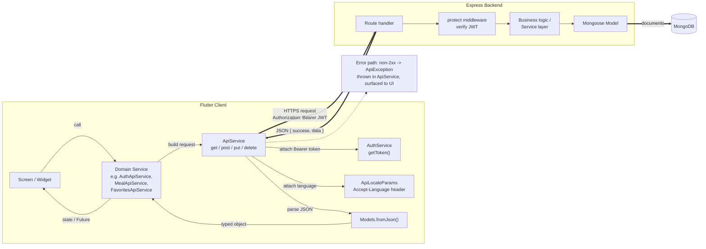
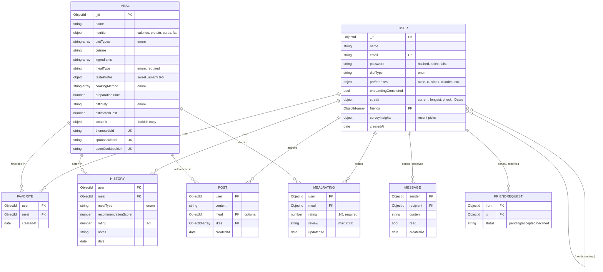
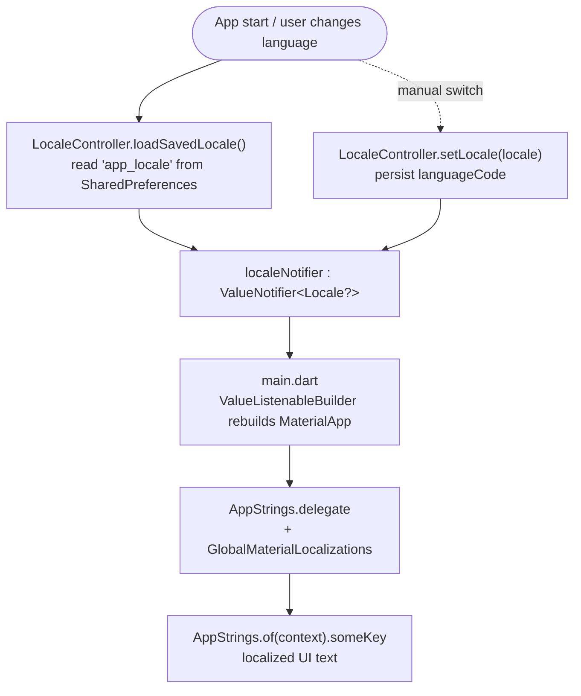
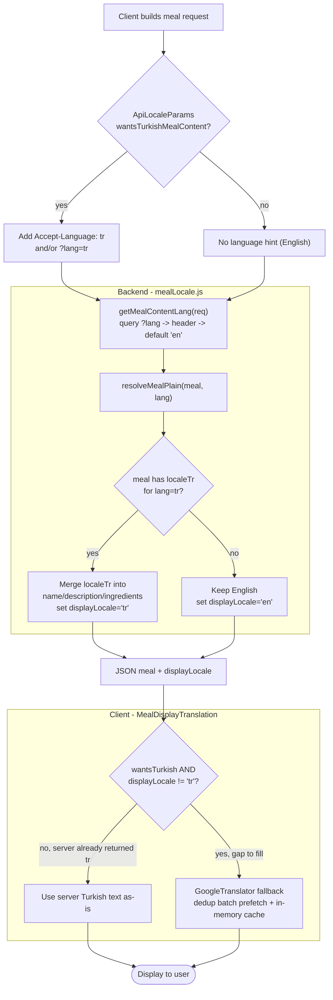
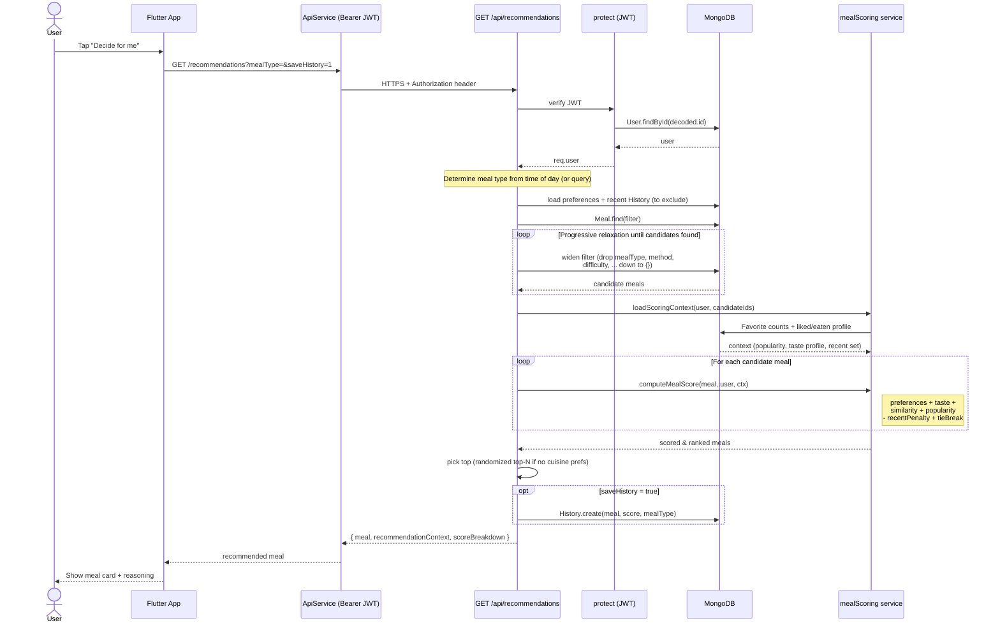

# DeciDish — Architecture Diagrams

DeciDish is a meal‑recommendation and food‑social application built as a full‑stack
system:

- **Mobile client** — Flutter (Dart), iOS + Android.
- **Backend API** — Node.js + Express, JWT auth, RESTful.
- **Database** — MongoDB (via Mongoose ODM).
- **Push notifications** — Firebase Cloud Messaging (FCM).
- **External recipe sources** — TheMealDB, Spoonacular, Open Cookbook (offline import scripts).

All diagrams use [Mermaid](https://mermaid.js.org/) and render directly in Cursor's
Markdown preview, on GitHub, and in most Markdown viewers.

## Contents

1. [System Architecture Diagram](#1-system-architecture-diagram)
2. [Frontend / Backend Flow](#2-frontend--backend-flow)
3. [Database Schema](#3-database-schema)
4. [Localization Workflow](#4-localization-workflow)
5. [Recommendation Flow](#5-recommendation-flow)

---

## 1. System Architecture Diagram

End‑to‑end view of all components, their layers, and the external systems they
depend on.

---

## 2. Frontend / Backend Flow

How a request travels from a screen, through the client's layered services, over
HTTP to Express, and back. The client never calls HTTP from the UI directly — it
always goes through a domain service and the shared `ApiService` wrapper.

---

## 3. Database Schema

MongoDB collections, their fields, and references. `||--o{` = one‑to‑many,
`}o--o{` = many‑to‑many, `UK` = unique key, `FK` = reference to another document.

**Unique constraints:** `User.email`; `Favorite (user, meal)`;
`FriendRequest (from, to)`; `Meal.themealdbId / spoonacularId / openCookbookUrl`
(sparse). `MealRating (user, meal)` is intentionally **non‑unique** so a user can
post multiple reviews of the same meal over time.

---

## 4. Localization Workflow

DeciDish localizes two distinct things, each with its own pipeline.

### 4a. UI strings + locale selection

Static UI text is fully translated via `AppStrings`; the active locale is held in a
`ValueNotifier` and persisted, so the whole app rebuilds when the user switches
languages.

### 4b. Meal content (data) localization — two-tier

Meal text (names, descriptions, ingredients) is localized server‑first, with an
on‑device machine‑translation fallback.

---

## 5. Recommendation Flow

The "Decide for me" path: an authenticated request that filters candidate meals,
scores them with a weighted engine, and returns the best match with a transparent
score breakdown.

### Scoring weights (from `services/mealScoring.js`)

| Signal | Source | Max contribution |
| --- | --- | --- |
| Meal type match | current time / preferred types | +26 (exact) / +12 (preferred) |
| Diet type match | `user.dietType` | +28 |
| Preferred cuisine | match +40, **mismatch −48** | ±40/48 |
| Taste compatibility | profile vs meal taste | +38 |
| Calorie range | within min/max | +16 |
| Prep time / difficulty / method / season | preferences | +12 / +10 / +12 / +8 |
| Similarity to likes & history | cuisine, tags, ingredients (Jaccard), taste | up to +55 |
| Community popularity | favorite count (log‑scaled) | up to +24 |
| Recently seen penalty | last ~20 history meals | −14 |
| Tie‑break | random | +0…1.8 |

---

### Key design notes

- **Stateless auth:** the JWT (signed with `JWT_SECRET`, ~7‑day expiry) is the only
  session artifact, stored client‑side in `SharedPreferences`.
- **Layered client:** UI → domain service → `ApiService` → HTTP; errors become a
  typed `ApiException`.
- **Server‑first localization** with an on‑device translation fallback keeps
  payloads small while still covering meals that lack a stored Turkish variant.
- **Progressive query relaxation** guarantees the recommender always returns a meal,
  even when strict preferences match nothing.
